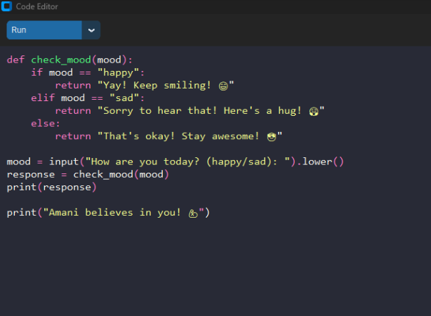

# 🐍 Python Code Editor

A simple, user-friendly **Python Code Editor** built using **Python** and **Tkinter**. This editor allows users to write, run, and save Python code in a clean, interactive environment. It provides features like syntax highlighting, error handling, and an output console for displaying results. 💻✨

## 🛠 Features

- ✍️ **Write and Edit Python Code**: Provides a text area for writing Python code with basic syntax highlighting.
- ▶️ **Run Python Code**: Executes the code within the editor and shows output in the integrated console.
- 💾 **Save Code**: Allows users to save their code to a `.py` file.
- 🚨 **Error Handling**: Displays errors in case of incorrect syntax or runtime exceptions.
- 🎨 **Simple User Interface**: Built with a minimalist design for a better coding experience.

## 📸 Screenshots



## 📦 Installation

### 📝 Requirements:
- **Python 3.x** 🐍
- **Tkinter** (usually included with Python by default)

### 🛠 How to Set Up:

1. **Clone this repository**:
   ```bash
   git clone https://github.com/your-username/python-code-editor.git
